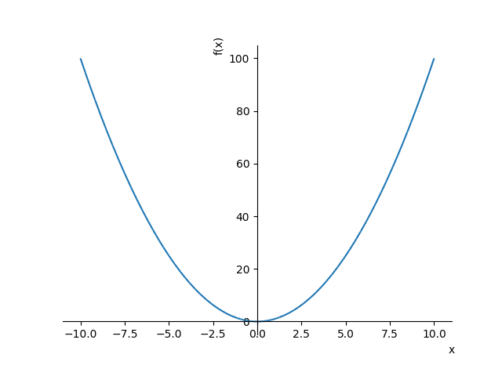

# Math Bot

## Setup

Add your **api_id**, **api_hash**, **bot_token** in *settings.json*.

## Requirements

This example requires some additional packages:

- Sympy

## Running

Enter in *mathBot* folder and run:

```shell
python main.py
```

## Input

Write some text messages to your *mathBot*. Example:

```
>> You: 3/2*5
>> You: x**2
```

## Output

Bot response:

```
>> Bot: 7.5
>> Bot: [Image below]
```

